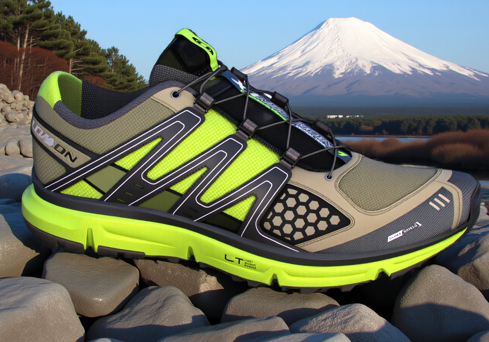

# RaySKU Locker v1





```

###2. Updated `README.md`I have replaced "Infinite Shelf" with "**RaySKU Locker**" throughout the documentation.

---

#📦 RaySKU Locker: Agentic Product Photography Studio> **Automated, photorealistic product staging with 100% SKU fidelity.**

**RaySKU Locker** acts as an AI-powered virtual photo studio. It allows brands to take a single product photo (a "SKU") and place it into any environment imaginable using natural language, without ever hallucinating or altering the original product's pixels.

##🎯 The ProblemGenerative AI models like Midjourney or DALL-E are incredible at creativity but terrible at product fidelity. They inherently want to "dream" and reimagine, which is unacceptable for e-commerce. If you upload a specific Nike shoe, the AI will often change the laces, warp the logo, or alter the sole texture to fit the scene.

**"SKU Locking"**—keeping the product exact while changing everything else—is the biggest hurdle in professional AI photography.

##💡 The Solution: A Multi-Agent Physics PipelineRaySKU Locker solves this not with a single model, but with an **agentic workflow** that separates creative direction, set design, and photographic physics into distinct stages.

We don't ask one AI to "draw a shoe on a mountain." We ask a team of AIs to build a scene around *your* shoe.

###🏗️ ArchitectureThe pipeline consists of three main stages executing sequentially:

####**Stage 1: The Creative Director (Brain)*** **Model:** **Cerebras Inference (Llama 3.1 70B)**
* **Role:** Translates a vague user prompt (e.g., "Mount Fuji sunrise") into a highly structured, physics-based JSON brief.
* **Output:** A JSON schema defining lighting direction (e.g., "Front-Left"), specific objects ("Torii gate located in foreground"), camera angle, and mood.

####**Stage 2: The Set Designer (Background)*** **Model:** **Bria FIBO (via Fal.ai)**
* **Role:** Generates a high-fidelity, photorealistic background plate based *only* on the setting and objects defined by the Agent. Crucially, it is instructed to leave negative space for the product.
* **Why Bria?** It is trained on licensed data, making it safe for enterprise commercial use and exceptionally good at following structured scene instructions.

####**Stage 3: The Gaffer & Compositor (Physics)*** **Model:** **IC-Light V2 (via Fal.ai)**
* **Role:** The physical integration engine. It takes the original SKU (foreground), the generated Bria scene (background), and the lighting instructions from the Agent.
* **The Magic:** It calculates how the light from the Bria background should hit the 3D geometry of the SKU, creating realistic shadows, reflections, and highlights *without altering the source pixels*.

---

##🚀 Key Features* **🔒 100% SKU Lock:** The product pixels you upload are the exact pixels in the final image. No generative reimagining of the asset itself.
* **🗣️ Natural Language Control:** Drive complex photographic physics (lighting angles, lens choices) with simple text descriptions.
* **🕵️‍♂️ Staging Inspector:** A transparent UI panel that reveals the AI Agent's "JSON Brain," showing exactly how it interpreted your prompt into physics instructions.
* **⚡ Blazing Fast Inference:** Powered by Cerebras for instant agent reasoning and Fal.ai's optimized GPU infrastructure for generation.

##🛠️ Tech Stack* **Framework:** Next.js 16 (Turbopack)
* **Styling:** Tailwind CSS v4
* **UI Components:** Shadcn UI
* **AI Agent API:** Cerebras (Llama 3.1)
* **Generative Media API:** Fal.ai (Bria FIBO & IC-Light V2)

##📦 Getting Started###Prerequisites* Node.js 18+
* pnpm (recommended) or npm/yarn

###Installation1. **Clone the repository:**
```bash
git clone https://github.com/yourusername/raysku-locker.git
cd raysku-locker

```


2. **Install dependencies:**
```bash
pnpm install

```


3. **Set up Environment Variables:**
Create a `.env.local` file in the root directory and add your API keys:
```env
# Fal.ai API Key for Image Generation Models
FAL_KEY=your_fal_key_here

# Cerebras API Key for the AI Agent
CEREBRAS_API_KEY=your_cerebras_key_here

# Optional: Bria API Key (if needed for direct SDK usage)
BRIA_KEY=optional_key_here

```


4. **Run the development server:**
```bash
pnpm run dev

```


5. Open [http://localhost:3000](https://www.google.com/search?q=http://localhost:3000) with your browser.

##📸 Usage Workflow1. **Locker:** Drag and drop a transparent product PNG (SKU) into the left-hand "SKU Locker."
2. **Prompt:** Select the SKU and type a scene description (e.g., "A luxury watch on a wet slate rock, moody lighting, moss in background").
3. **Generate:** Click generate. Watch the "Staging Inspector" populate with the plan, and see the final composition appear center stage.
4. **Download:** Get the high-fidelity asset ready for use.