# RaySKU Locker v1


# 📦 RaySKU Locker

> **The Agentic Product Photography Studio.** > Automated, photorealistic product staging with 100% SKU fidelity using Physics-Guided Diffusion.


**RaySKU Locker** allows brands to take a single transparent product photo (a "SKU") and place it into any environment imaginable using natural language, without **ever** hallucinating or altering the original product's pixels.


---

## 🎯 The Problem: The "Hallucination" Gap

Generative AI models (Flux, Midjourney, DALL-E) are creative engines, not physics engines. They inherently want to "dream" and reimagine. In e-commerce, this is fatal:
* **The Hallucination:** Upload a specific running shoe, and the AI changes the laces, warps the logo, or invents a new sole texture.
* **The Requirement:** **"SKU Locking"**—the ability to keep the product asset 100% pixel-perfect while completely generating the surrounding light and environment.

## 💡 The Solution: A Dual-Stage Agentic Pipeline

RaySKU Locker solves this by decoupling **Creative Direction** from **Physical Compositing**. We don't ask one model to do everything. We employ a chain of specialized AI agents:

### 🏗️ Architecture

```mermaid
graph TD
    User["🗣️ User Prompt"] --> Agent["🧠 Creative Director (Cerebras/Llama 3.1)"]
    Agent -->|JSON Brief| Inspector["📝 Staging Inspector (UI)"]
    Agent -->|Scene Description| Stage1["🎨 Set Designer (Bria FIBO)"]
    Agent -->|Lighting Physics| Stage2["💡 Gaffer & Compositor (IC-Light V2)"]
    SKU["👟 Raw SKU (PNG)"] --> Stage2
    Stage1 -->|Background Plate| Stage2
    Stage2 -->|Relit Composite| Final["🖼️ Final 16-bit Asset"]

```



1. **🧠 Stage 1: The Brain (Cerebras Llama 3.1)**
* Translates vague vibes (e.g., "Mount Fuji sunrise") into a **physics-based JSON brief**.
* Determines: Light direction, camera angle, specific objects, and negative space requirements.


2. **🎨 Stage 2: The Set (Bria FIBO)**
* Generates a safe, photorealistic background plate based *only* on the JSON spatial brief.
* **Why Bria?** Enterprise-safe, licensed data training ensures high-fidelity backgrounds without copyright risks.


3. **💡 Stage 3: The Physics (IC-Light V2)**
* Calculates **Light Transport**. It takes the original SKU and the Bria background, then mathematically re-lights the SKU to match the environment's luminance and color temperature.
* **Result:** A composite where the product looks like it was physically photographed on location.


---

##🚀 Key Features* **🔒 True SKU Lock:** The product pixels you upload are the exact pixels in the final image.
* **🕵️‍♂️ Staging Inspector:** A real-time transparent UI panel that reveals the Agent's "JSON Brain," allowing you to verify lighting and camera decisions before generation.
* **⚡ Blazing Fast Inference:** Powered by **Cerebras** for instant reasoning (<0.5s) and **Fal.ai** optimized GPUs for generation.
* **💧 Hydration-Safe UI:** Built on Next.js 16 with robust client-side mounting checks for a glitch-free experience.

##🛠️ Tech Stack* **Frontend:** Next.js 16 (App Router), Tailwind CSS v4, Lucide React
* **UI Library:** Shadcn UI (Radix Primitives)
* **AI Orchestration:** Cerebras (Llama 3.1 70B)
* **Image Generation:** Fal.ai (Bria FIBO & IC-Light V2)

---

##📦 Getting Started###1. Clone & Install```bash
git clone [https://github.com/mikoaro/raysku-locker.git](https://github.com/yourusername/raysku-locker.git)
cd raysku-locker
pnpm install

```

###2. Configure EnvironmentCreate a `.env.local` file in the root directory. You only need two keys:

```bash
# 1. Get this from [https://fal.ai/dashboard/keys](https://fal.ai/dashboard/keys)
FAL_KEY=your_fal_key_here

# 2. Get this from [https://cloud.cerebras.ai/](https://cloud.cerebras.ai/)
CEREBRAS_API_KEY=your_cerebras_key_here

# (Optional) Direct Bria SDK Key - Not required if using Fal
BRIA_KEY=

```

###3. Run Development Server```bash
pnpm run dev

```

Open [http://localhost:3000](https://www.google.com/search?q=http://localhost:3000) to enter the studio.

---

##📸 How to Use1. **Upload:** Drag a transparent PNG of your product into the **SKU Locker** (left sidebar).
2. **Brief:** Select the SKU and type a prompt (e.g., *"A luxury watch on a wet slate rock, moody lighting, moss in background"*).
3. **Inspect:** Watch the **Staging Inspector** (right sidebar) populate instantly with the Agent's lighting plan.
4. **Generate:** Click "Generate" to run the pipeline.
5. **Download:** Save the final asset as a high-fidelity image.

---

##📄 LicenseThis project is licensed under the MIT License - see the [LICENSE](https://www.google.com/search?q=LICENSE) file for details.

##🙏 Acknowledgements* **Bria AI** for the responsible, high-quality base models.
* **Fal.ai** for the lightning-fast inference infrastructure.
* **Cerebras** for enabling real-time agentic reasoning.

```

```